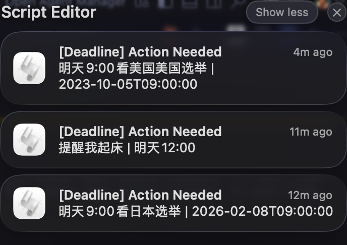

# LivePipe

[](README.md)
[](README.zh-CN.md)

> **Low-Key Preview** — 当前版本不稳定，效果欠佳，仅供研究与测试。

基于 [Screenpipe](https://github.com/mediar-ai/screenpipe) + 本地大模型 ([Ollama](https://ollama.com)) 的实时屏幕内容分析工具。自动监控屏幕内容，检测到待办、提醒、会议、截止时间等可执行事项时发送桌面通知。



## THE NEXT STEP

- [ ] 与 OpenClaw 协同审查识别到的屏幕内容，确认是否输出。

## 开始使用

### 环境依赖

- **macOS**
- [Bun](https://bun.sh/)
- [Ollama](https://ollama.com/)（默认模型：`qwen3:1.7b`）
- [Screenpipe CLI](https://github.com/mediar-ai/screenpipe)
- [PM2](https://pm2.keymetrics.io/)（`bun install -g pm2`）

### 安装

```bash
git clone https://github.com/cyrus-cai/livepipe.git
cd livepipe
bun install

# 拉取默认 LLM 模型
ollama pull qwen3:1.7b

# 复制配置模板
cp config.template.json config.json
```

### 运行

```bash
# 启动开发模式（通过 PM2 自动管理 Screenpipe + Ollama）
bun run dev
```

dev 脚本会：
1. 检查 Screenpipe、Ollama、PM2 是否已安装
2. 通过 PM2 启动 Screenpipe 和 Ollama
3. 在 `http://localhost:3060` 启动 Next.js 开发服务器
4. 开始轮询屏幕内容并发送通知

### macOS 权限

在 **系统设置 -> 隐私与安全性** 中为终端应用授予以下权限：

- **屏幕录制** — Screenpipe 捕获屏幕内容所需
- **通知** — 桌面通知所需

## 通知通道

默认情况下，LivePipe 通过 AppleScript 发送 macOS 桌面通知。
你也可以在 `pipe.json` 里开启 Webhook，把消息推送到第三方客户端（例如飞书或 Telegram）：

```json
{
  "notification": {
    "desktop": true,
    "webhooks": [
      {
        "enabled": true,
        "provider": "feishu",
        "url": "https://open.feishu.cn/open-apis/bot/v2/hook/your-hook"
      },
      {
        "enabled": true,
        "provider": "telegram",
        "url": "https://api.telegram.org/bot<token>/sendMessage",
        "chatId": "<chat-id>"
      },
      {
        "enabled": true,
        "provider": "generic",
        "url": "https://your-webhook-endpoint.example.com/livepipe",
        "headers": {
          "X-Api-Key": "your-secret"
        }
      }
    ]
  }
}
```

- `provider` 支持 `feishu`、`telegram`、`generic`
- `desktop: true` 会保留原有 macOS 通知
- `generic` 会发送标准 JSON（含 `title`、`body`、`type`、`dueTime` 等字段）
- 修改 `pipe.json` 后请重启 `live`

## 许可证

MIT
